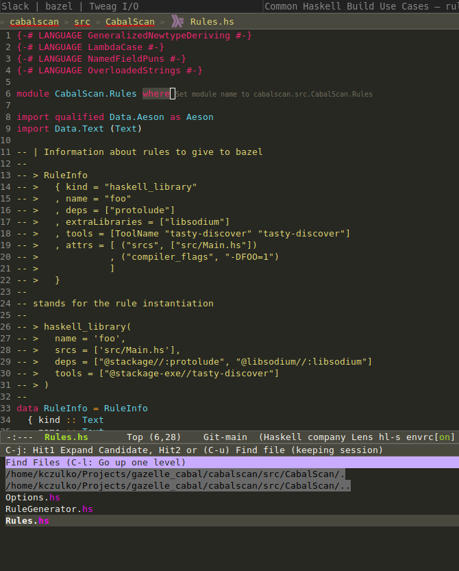

# HLS support and question

I used this (guide)[https://rules-haskell.readthedocs.io/en/latest/haskell-use-cases.html#configuring-ide-integration-with-ghcide]

The main problem: haskell code is placed under `cabalscan` directory and there is "hie-bios" target definition.

Because of that bazel-bin/cabalscan/hie-bios@hie-bios contains at the end following entries:
```
cabalscan/exe/Main.hs
cabalscan/src/CabalScan/Options.hs
cabalscan/src/CabalScan/RuleGenerator.hs
cabalscan/src/CabalScan/Rules.hs
```

And it's something that is probably causing such hls behavior (rename module lens popped up): 


### question:

I'm wondering how to configure a project where I would have more than one directory with a haskell project?

Multiple `haskell_repl` entries with multiple `.hie-bios` files per directory? And then `M-x lsp-workspace-folders-add`
for every folder in a monorepo with haskell project?
